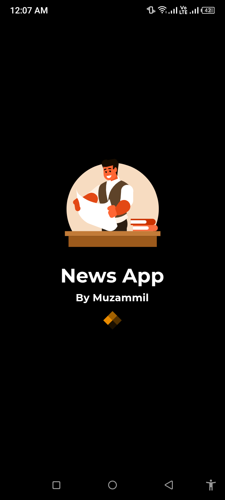
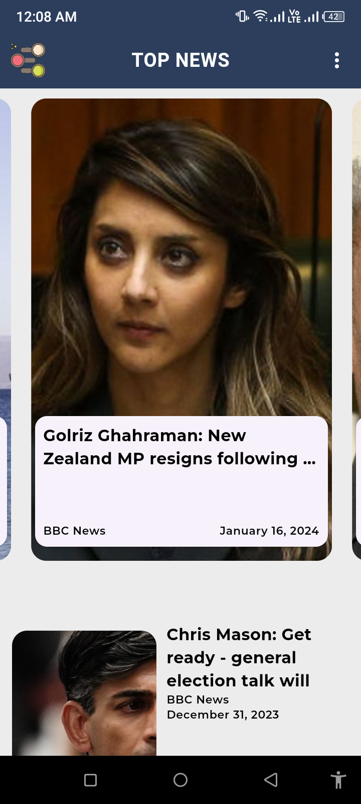
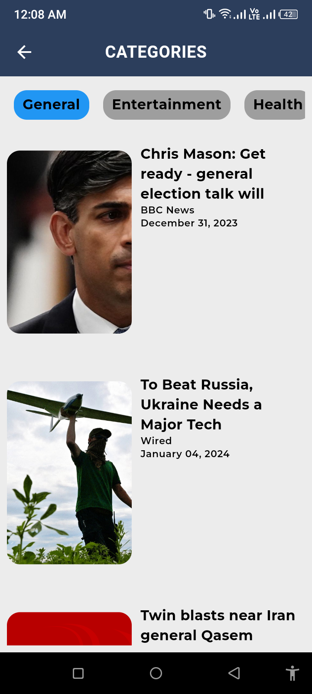
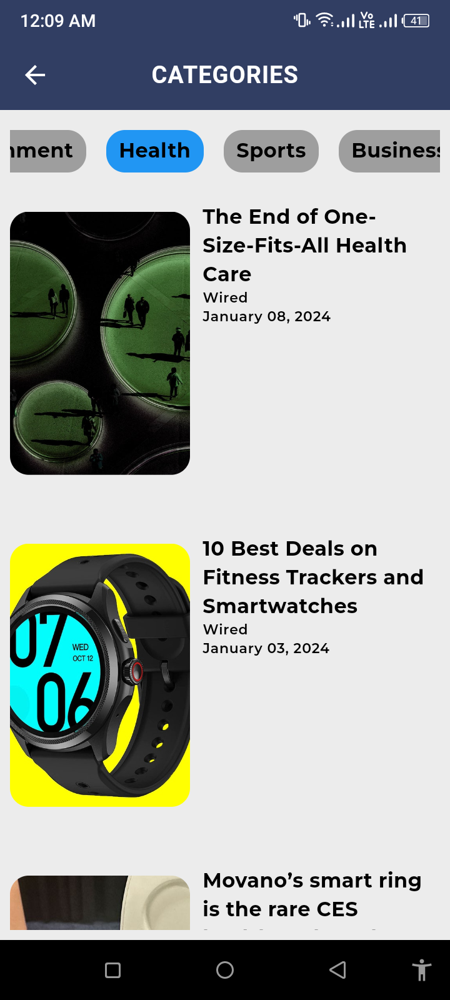
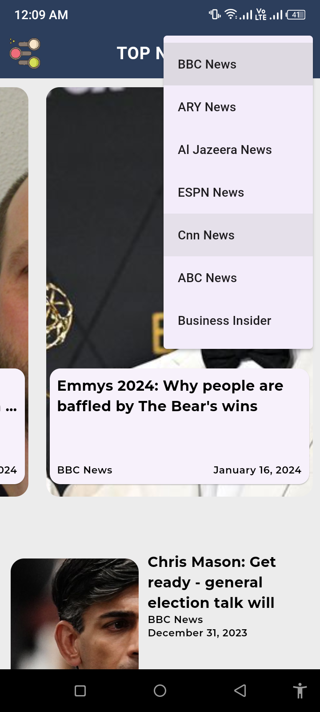

# News App         

## Overview

A Flutter-based mobile application that provides the latest news from various news channels. Users can choose their preferred news source to stay updated with the latest headlines.

## Features

- View top news headlines from different news sources.
- Select your preferred news channel to customize your news feed.
- User-friendly interface for easy navigation and news consumption.

## Screenshots
                      

                              

                              

                              

# Watch video

## Usage
Launch the app on your emulator or physical device.
Browse through the list of available news channels.
Select your preferred news channel.
Explore the latest news headlines.

## Acknowledgments:
Flutter - UI toolkit for building natively compiled applications for mobile, web, and desktop from a single codebase.

News API - API for fetching news headlines and articles.   https://newsapi.org/docs/get-started
